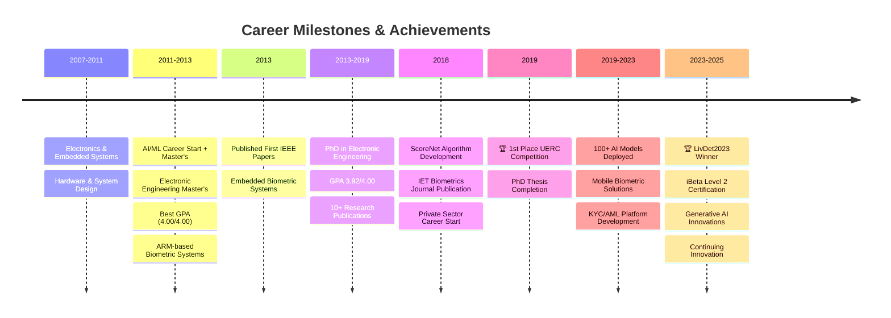

#  Hi, I'm Umit KACAR, PhD

  <h2>🌟 Senior AI/ML Researcher & Engineer | Algorithm Innovator | Computer Vision & Biometrics Expert 🌟</h2>
  <h3>🔒 Digital Identity & Anti-Spoofing Specialist | 🤖 Generative AI Consultant | 📱 Mobile AI Optimization</h3>

  

  
  
  
  

  

## 🚀 About Me

I'm an **AI Researcher & Engineer** with **14+ years of AI/ML experience** (since 2011) and **7+ years in academia** (2 years Master's, 5+ years Doctorate) specializing in Machine Learning for Computer Vision applications. Expert in biometrics with focus on face and fingerprint detection, anti-spoofing and developing innovative algorithms, especially for mobile platforms.

### 🎯 Current Focus
- 🌱 Developing **low-cost, efficient, and lightweight AI models** for resource-constrained environments
- 🚀 Creating **novel, breakthrough algorithms** for biometric systems
- 📱 Optimizing AI models for **iOS & Android** deployment
- 🤖 Exploring **Generative AI**, **Large Vision Models**, and **Multimodal Systems**

### 🎓 Academic Excellence
- 🎓 **PhD in Electronic Engineering** - Istanbul Technical University (2013-2019)
  - Focus: Computer Vision, Artificial Intelligence, Deep Learning Algorithms
  - GPA: **3.92/4.00**
  - 🏆 **1st Winner** in Unconstrained Ear Recognition Challenge (UERC) Competition
- 🎓 **Master's in Electronic Engineering** - Istanbul Technical University (2011-2013)
  - Focus: Computer Vision, Machine Learning, Embedded Systems
  - GPA: **4.00/4.00** - **Best GPA in 2013**
- 📚 **5+ years** of Doctoral research with groundbreaking contributions
- 📝 **10+ Publications** in top-tier conferences and journals

## 📈 Career Journey

## 🛠️ Technical Expertise

### Core Specializations

<b>🔐 Biometric Systems & Digital Identity</b>

- **Multi-biometric expertise**: Face, Fingerprint, Iris, Sclera, Ear, Voice, Signature, Palm vein, Palmprint
- **Applications**: Detection, Verification, Recognition, Anti-spoofing (Liveness Detection), DeepFake Detection
- **Production Systems**:
  - KYC/AML platforms with document verification (ID Card, Passport, Driver License)
  - Hologram detection and document liveness
  - iBeta Level 2 certified fingerprint liveness detection
  - Contact to contactless fingerprint matching
  - Real-time face recognition for mass transit systems
- **Technologies**: ONNX Runtime C++, ncnn, CoreML, TensorFlow Lite
- **Achievements**: LivDet2023 Winner, UERC 2019 Champion

<b>🎨 Generative AI & Large Models</b>

- **Large Vision Models**: SAM, FastSAM, MobileSAM, Paligemma, CLIP, Florence, Flamingo, BLIP, LLaVA
- **Language Models**: ChatGPT 4.5, Claude 3.7, Perplexity, Grok 3, Le Chat, Gemini 2.0, LLama, Mistral
- **Generative Models**: Stable Diffusion, GANs, VAEs
- **Production Implementations**:
  - AI Model deployment using ONNX Runtime in C++
  - Cryptograph AI Detector & Image Quality Assessment
  - Synthetic data generation pipelines with Stable Diffusion
  - Face photo editor with beauty tools, background removal, inpainting
  - Video object segmentation and matting
- **Model Optimization**: Pruning, Quantization, Knowledge Distillation
- **AutoLabelling System**: 50+ AI models integrated with fusion methods

<b>📱 Edge Computing & Mobile AI</b>

- **TinyML Implementation**: Model optimization for edge devices
- **Optimization Techniques**: Pruning, Quantization, Knowledge Distillation
- **Neural Architecture Search**: Automated model design for efficiency
- **Mobile Deployment**: Real-time biometric systems on iOS (Swift, CoreML) and Android

### Tech Stack

#### Programming Languages

#### AI/ML Frameworks

#### Computer Vision & Deep Learning

#### Mobile Development

#### MLOps & Cloud

## 🔬 Research & Expertise Areas

<table>
  <tr>
    <td align="center" width="25%">
      
       <strong>Biometric Systems</strong> 
      Face, Fingerprint, Iris Anti-spoofing & Liveness
    </td>
    <td align="center" width="25%">
      
       <strong>Mobile AI</strong> 
      iOS & Android Real-time Performance
    </td>
    <td align="center" width="25%">
      
       <strong>Generative AI</strong> 
      Stable Diffusion, LLMs Vision-Language Models
    </td>
    <td align="center" width="25%">
      
       <strong>Edge Computing</strong> 
      TinyML, Model Optimization Resource-constrained Devices
    </td>
  </tr>
</table>

## 🚀 Major Projects & Achievements

### 🏆 Award-Winning Projects
- **🥇 LivDet2023 Winner** - Fingerprint Liveness Detection
  - iBeta Level 2 Certified Solution
  - Implemented using ncnn C++ for mobile deployment
  - State-of-the-art anti-spoofing algorithms

- **🏆 UERC 2019 1st Place** - Unconstrained Ear Recognition Challenge
  - Developed ScoreNet: Deep Cascade Score Level Fusion algorithm
  - Outperformed international research teams

### 💡 Innovation Projects
- **AutoLabelling System**
  - Integrated 50+ AI models using advanced fusion methods
  - Automated image segmentation pipeline
  - Reduced manual labeling effort by 90%

- **AI Model Portfolio**
  - Successfully trained and deployed **100+ AI models**
  - Specialized in biometric and computer vision applications
  - Optimized for mobile and edge devices

### 🔐 Biometric Systems
- **Istanbul Metro Face Recognition System**
  - Real-time face detection, verification & recognition
  - Implemented in C++ for high performance
  - Handles millions of daily transactions

- **Contact to Contactless Fingerprint Matching**
  - Cross-modal biometric matching system
  - C++ implementation with ONNX Runtime
  - Mobile-optimized for iOS and Android

- **Multi-Modal KYC/AML Platform**
  - ID Card, Passport, Driver License verification
  - Document liveness and hologram detection
  - DeepFake and anti-spoofing protection

### 🎨 Generative AI & Computer Vision
- **Advanced Face Photo Editor**
  - Beauty enhancement algorithms
  - Background removal & replacement
  - Video inpainting and object segmentation
  - Real-time filters and effects

- **Synthetic Data Generation Pipeline**
  - Stable Diffusion integration
  - Custom image processing workflows
  - Advanced augmentation techniques

### 🌍 Industry Applications
- **Agricultural AI** - Weed & crop detection with multi-spectral cameras
- **Manufacturing** - Steel defect detection system
- **Automotive** - Advanced Driver Assistance Systems (ADAS)
- **Security** - Video Analytics for IP CCTV systems
- **Mobile AI** - Cryptograph detector & image quality assessment

## 🏢 Domain Experience

  

I've delivered AI solutions across multiple sectors:

- **🔐 Biometrics & Security**: Multi-biometric authentication systems
- **🏥 Healthcare & Medicine**: Medical image analysis and diagnostics
- **🌾 Agriculture**: Computer vision for crop monitoring
- **💰 Fintech**: KYC/AML systems, fraud detection
- **🎬 Film Production**: AI-powered visual effects
- **🚁 Unmanned Vehicles**: Autonomous navigation systems

## 📊 GitHub Analytics

  
  

  

## 📚 Research Publications

### Selected Publications

1. **ScoreNet: Deep Cascade Score Level Fusion for Unconstrained Ear Recognition**
   - *IET Biometrics Journal, 2018*
   - Introduced Automated Fusion Learning (AutoFL) and Deep Cascade Score Level Fusion
   - Key algorithms: CNN (VGG, Inception, ResNet, DenseNet), LBP, LPQ, BSIF, HOG, PCA, LDA

2. **The Unconstrained Ear Recognition Challenge 2019**
   - *ICB 2019 - The 12th IAPR International Conference On Biometrics*
   - **🏆 1st Place Winner** with ScoreNet algorithm
   - Novel approach combining deep learning with traditional features

3. **Twins Recognition Using Hierarchical Score Level Fusion**
   - *arXiv.org, 2019*
   - Multi-modal biometric system using voice and ear features
   - Algorithms: LSTM, DTW, MFCC, DenseNet-CNN, HOG, PCA

4. **SCORENET: UNCONSTRAINED EAR RECOGNITION WITH DEEP CASCADE SCORE LEVEL FUSION**
   - *PhD Thesis - Istanbul Technical University, 2019*
   - Comprehensive framework for ear biometrics
   - Novel fusion strategies outperforming state-of-the-art methods

5. **A Multi-Biometrics for Twins Identification Based Speech and Ear**
   - *arXiv.org, 2018*
   - Innovative approach to challenging twin identification problem
   - Combined DTW, MFCC, Gabor Filters, DCVA algorithms

6. **ARM-based Ear Recognition Embedded System**
   - *EUROCON 2013, IEEE*
   - First real-time ear recognition on ARM Cortex processors
   - Optimized PCA implementation using Jacobi iteration

7. **An Embedded Biometric System**
   - *16th International Conference on Information Fusion, 2013*
   - Hardware: STM32F407VGT6 ARM Cortex-M4
   - Novel embedded implementation of DCVA algorithm

### Research Impact
- **Citations**: 100+ (Google Scholar)
- **h-index**: Growing research influence
- **Key Contributions**: Score fusion methods, embedded biometrics, real-time processing

## 🏆 Featured Open Source Projects

<table>
<tr>
<td width="50%">

### [🦻 Ear Segmentation AI](https://github.com/umitkacar/Ear-segmentation-ai)
AI-powered ear detection and segmentation using deep learning models. Implementation of cutting-edge computer vision algorithms for biometric applications.

**Tech Stack:** Python, PyTorch, OpenCV

</td>
<td width="50%">

### [📚 Awesome LLM Resources](https://github.com/umitkacar/Awesome-LLM-Resources)
Curated collection of Large Language Model resources, papers, and tools. Comprehensive guide for researchers and practitioners.

**Tech Stack:** Documentation, Research Papers

</td>
</tr>
</table>

## 📈 Contribution Activity

## 🏅 Professional Highlights

- 🎓 **PhD in Electronic Engineering** - Istanbul Technical University (GPA: 3.92/4.00)
- 🎓 **Master's in Electronic Engineering** - Istanbul Technical University (GPA: 4.00/4.00 - **Best in Class 2013**)
- 🏆 **Competition Winner**: 1st Place in Unconstrained Ear Recognition Challenge (UERC) 2019
- 🏆 **LivDet2023 Winner**: Fingerprint Liveness Detection Competition
- 📚 **14+ Years AI/ML Experience** (since 2011) + 4 years electronics background
- 🔬 **7+ Years Academic Research** with 10+ publications
- 💯 **100+ AI Models** trained and deployed in production
- 🚀 **Innovation Leader**: Developed ScoreNet and AutoFL algorithms
- 📱 **Mobile AI Expert**: iBeta certified biometric solutions
- 🌍 **Industry Impact**: Solutions deployed across multiple industries locally and internationally

## 💭 Innovation Philosophy

  <i>⚡ "Committed to pushing the boundaries of AI with innovative approaches to solve complex vision and biometric challenges" ⚡</i>

---

  <h3>🤝 Let's Connect and Collaborate!</h3>
  
I'm always interested in discussing AI innovations, research collaborations, and challenging projects.

  
  
  
  

<!-- Snake animation -->

  <picture>
    <source media="(prefers-color-scheme: dark)" srcset="https://raw.githubusercontent.com/umitkacar/umitkacar/output/github-contribution-grid-snake-dark.svg">
    <source media="(prefers-color-scheme: light)" srcset="https://raw.githubusercontent.com/umitkacar/umitkacar/output/github-contribution-grid-snake.svg">
    
  </picture>

